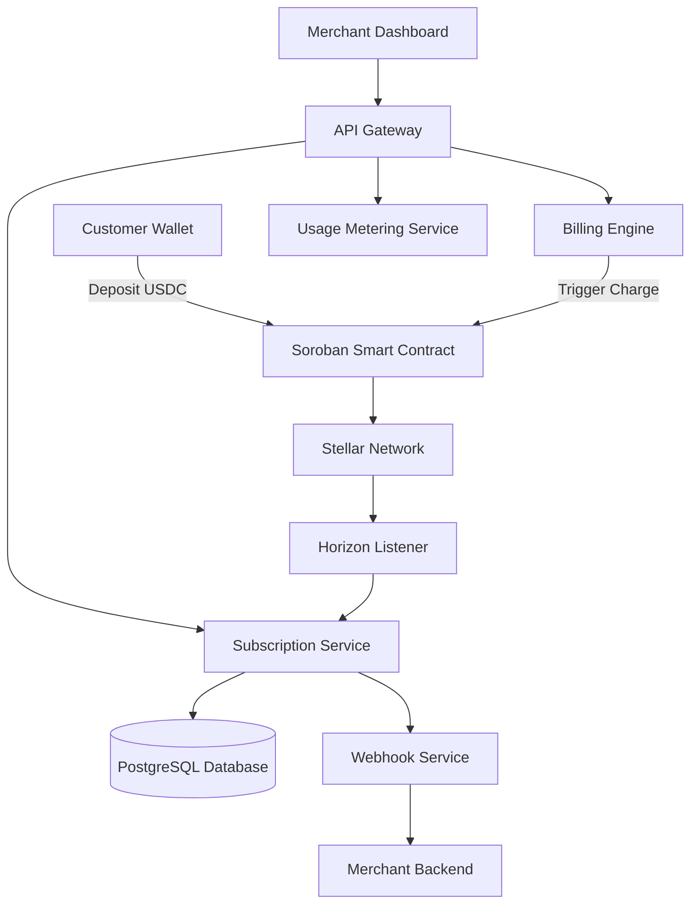
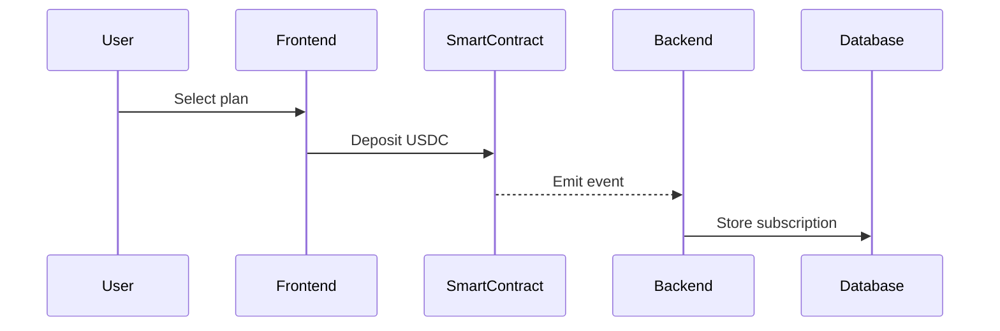
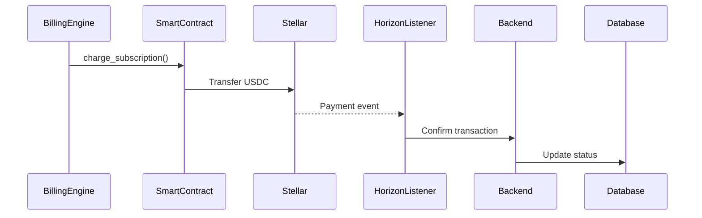
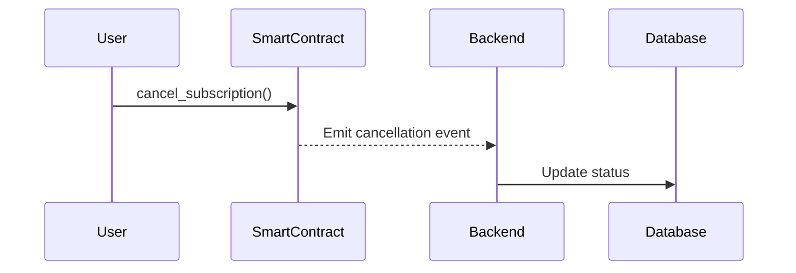
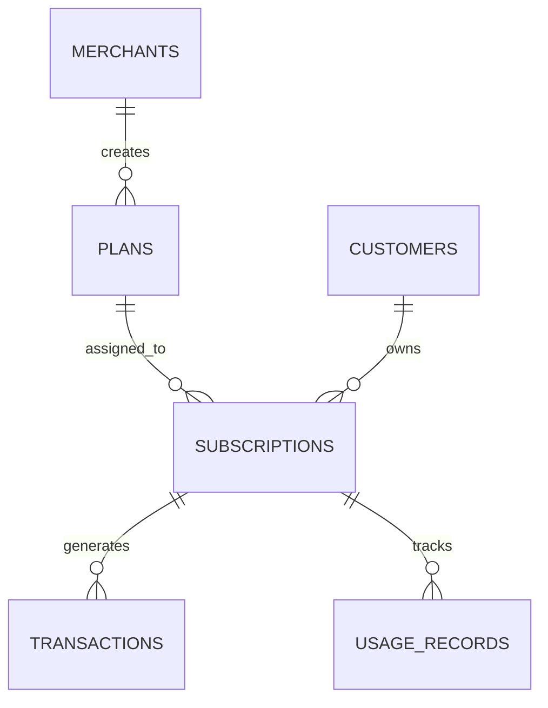

# Stellar Subscription Engine

## Recurring USDC Billing Infrastructure on Stellar

---

## 1. Overview

The Stellar Subscription Engine is a recurring billing infrastructure built on the Stellar blockchain using Soroban smart contracts. It enables SaaS businesses to accept USDC-based subscription payments with automated billing cycles, usage-based billing support, and merchant APIs.

This system acts as a Web3-native billing layer comparable to Stripe's subscription infrastructure, optimized for low-fee, high-speed settlement on Stellar.

---

## 2. Problem Statement

Web3 currently lacks a standardized and reliable recurring billing mechanism.

**Key limitations:**

- No native recurring payment primitive
- No secure wallet auto-debit model
- Manual reconciliation for SaaS platforms
- Limited support for usage-based billing
- No infrastructure-grade billing API for Stellar ecosystem

---

## 3. Solution

The system introduces a **prepaid subscription vault model**:

- Users deposit USDC into a smart contract vault
- The contract releases funds on a defined billing interval
- Backend billing engine triggers on-chain execution
- Off-chain services handle indexing, analytics, and notifications

This approach avoids forced wallet deductions while maintaining automation.

---

## 4. System Architecture

### 4.1 High-Level Architecture



---

## 5. Core Components

### 5.1 Soroban Smart Contract

**Responsibilities:**

- Store subscription agreements
- Maintain subscriber vault balances
- Enforce billing intervals
- Execute payments
- Handle cancellations and grace periods

#### Contract Data Model

```rust
struct Subscription {
    subscriber: Address,
    merchant: Address,
    amount: i128,
    interval_seconds: u64,
    last_payment_timestamp: u64,
    status: SubscriptionStatus,
    prepaid_balance: i128,
    usage_enabled: bool,
}
```

#### Core Contract Methods

- `create_subscription()`
- `deposit_funds()`
- `charge_subscription()`
- `cancel_subscription()`
- `pause_subscription()`
- `withdraw_merchant_funds()`

### 5.2 Backend Services (Go-Based)

| Service | Description |
|--------|-------------|
| **API Gateway** | JWT authentication, API key management, rate limiting, request validation. Framework: Gin or Fiber |
| **Subscription Service** | Manage plans, sync on-chain subscription state, store metadata, handle user lifecycle |
| **Billing Engine** | Automated charging: periodic scheduler, identify due subscriptions, invoke `charge_subscription()` on-chain, update DB on confirmation |
| **Horizon Event Listener** | Subscribe to contract events, track payment confirmations, sync on-chain state to DB, detect failed transactions |
| **Usage Metering Service** | Usage-based billing: merchant reports usage → service calculates bill → billing engine deducts from vault |

#### Database Schema

- `merchants`
- `plans`
- `subscriptions`
- `customers`
- `transactions`
- `usage_records`

---

## 6. Billing Flow

### 6.1 Subscription Creation



### 6.2 Recurring Billing Cycle



### 6.3 Cancellation



---

## 7. Data Architecture



---

## 8. Auto-Deduction Model

Stellar does not allow forced wallet debits.

**Solution: Prepaid vault model**

- User deposits USDC in advance
- Contract releases funds per billing interval
- Insufficient balance → subscription suspension

**Optional enhancements:**

- Balance threshold alerts
- Auto-reminder notifications

---

## 9. Tech Stack

| Layer | Technologies |
|-------|--------------|
| **Blockchain** | Stellar Network, Soroban Smart Contracts, Stellar SDK |
| **Backend** | Go, PostgreSQL, Redis, gRPC (internal) |
| **Infrastructure** | Docker, Kubernetes, AWS or GCP |
| **Monitoring** | Prometheus, Grafana |
| **Event Processing** | Redis Streams or Kafka |

---

## 10. Security Considerations

- Strict signature validation
- Replay protection
- Contract upgrade mechanism
- Merchant authentication
- Rate limiting
- Input validation
- Grace period enforcement
- Transaction idempotency

---

## 11. Monetization Model

| Model | Description |
|-------|-------------|
| **Transaction Fee** | 0.5% to 1% per subscription charge |
| **SaaS Plan** | Free tier (limited subscriptions), Pro tier with analytics and usage billing |
| **API Monetization** | Metered API calls for merchants |

---

## 12. Scalability Strategy

| Phase | Focus |
|-------|--------|
| **Phase 1** | Fixed recurring subscriptions, prepaid vault system |
| **Phase 2** | Usage-based billing, analytics dashboard |
| **Phase 3** | SDKs for JavaScript, Go, Python; webhook integrations |
| **Phase 4** | Multi-chain expansion |

---

## 13. Risks and Mitigation

| Risk | Mitigation |
|------|-------------|
| User friction due to preload model | UI balance reminders and automated alerts |
| On-chain execution failures | Horizon listener and retry logic |
| Merchant abuse | API key controls and usage throttling |

---

## 14. Positioning

This system is **not** a consumer application. It is a **billing infrastructure layer** for the Stellar ecosystem.

**Target users:**

- Web3 SaaS platforms
- AI API providers
- Developer tools
- Indie software businesses

---

## 15. Conclusion

The Stellar Subscription Engine introduces a structured, programmable, and scalable recurring billing model for USDC on Stellar.

It leverages:

- Low transaction fees
- Fast settlement
- Soroban smart contracts
- API-driven backend architecture

This infrastructure can become a foundational billing layer for Web3-native SaaS applications within the Stellar ecosystem.
